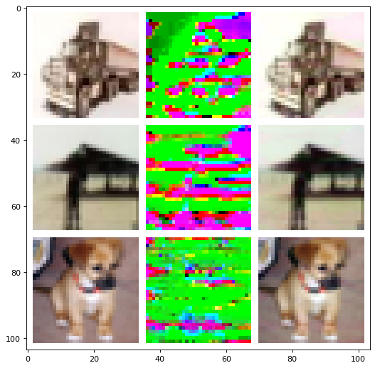

+++
title = "Unlearnable Examples: Making Personal Data Unexploitable"
+++


## Introduction
The volume of "free" data on the internet has been key to the current success of deep learning. However, it also raises privacy concerns about the unauthorized exploitation of personal data for training commercial models. It is thus crucial to develop methods to prevent unauthorized data exploitation.
We present a type of *error-minimizing noise* that can make training examples unlearnable to deep learning.


#### What are Unlearnable Examples?
*Unlearnable examples* are training examples unusable for Deep Neural Networks (DNNs).
DNNs trained on *unlearnable examples* will have a performance equivalent to random guessing on normal test
examples.


#### How they can protect your data?
Before you release your data to the wild, add an imperceptible noise to the data to create unlearnable data.


---
## Examples on CIFAR-10
In our code repository, we have a [QuickStart notebook](https://github.com/HanxunH/Unlearnable-Examples/blob/main/QuickStart.ipynb) that contains minimal implementations for sample-wise error-minimizing noise.



This is an example of Unlearnable Examples on CIFAR-10.
From left to right: Original Images, Visualization of the Error-Minimizing Noise and Unlearnable Images.


---
## ICLR-2021 Poster


---
## Team Members
* [Hanxun Huang](https://hanxunh.github.io/) The University of Melbourne
* [Xingjun Ma](http://xingjunma.com/) Deakin University
* [Sarah Erfani](https://people.eng.unimelb.edu.au/smonazam/) The University of Melbourne
* [James Bailey](https://people.eng.unimelb.edu.au/baileyj/) The University of Melbourne
* [Yisen Wang](https://yisenwang.github.io/) Peking University


---
## Cite Our Work
```
@inproceedings{huang2021unlearnable,
    title={Unlearnable Examples: Making Personal Data Unexploitable},
    author={Hanxun Huang
      and Xingjun Ma
      and Sarah Monazam Erfani
      and James Bailey
      and Yisen Wang},
    booktitle={ICLR},
    year={2021}
}
```
