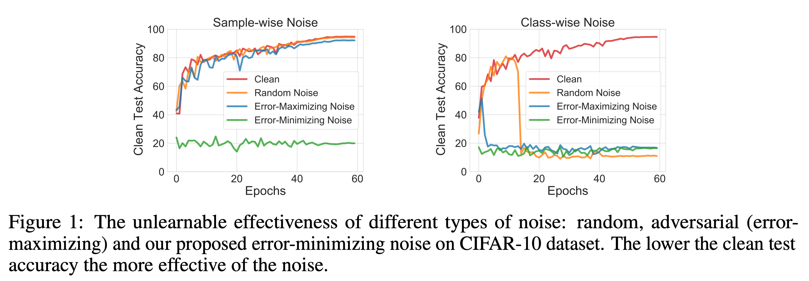

+++
title = "Unlearnable Examples: Making Personal Data Unexploitable"
+++

## We need more control of how our data is used!

The volume of "free" data on the internet has been key to the current success of deep learning. However, it also raises privacy concerns about the unauthorized exploitation of personal data for training commercial models. We believe it's crucial to develop methods to prevent unauthorized data exploitation. In this research, we present a type of *error-minimizing (unlearnable) noise* that can make training examples unlearnable to deep learning.

*The unlearnable noise can be used as a key by an individual to “lock” their data, so that it can’t easily be used by others for training their machine learning systems. This gives the owner more control about how their data is used.*


---
#### What are Unlearnable Examples?
*AI is supposed to learn from its own mistakes (errors).  But what happens if there are no mistakes or it is too easy to learn, will learning stop?*

*Unlearnable examples* exploits the above aspect of AI and tricks the model to believe *there is nothing to learn*.

*Unlearnable examples* are training examples unusable for Deep Neural Networks (DNNs): DNNs trained on *unlearnable examples* will have a performance equivalent to random guessing on normal test examples.




#### How they can protect your data?
Before you release your data to the wild, add an imperceptible noise to the data to create unlearnable data.


---
## Examples on CIFAR-10
In our code repository, we have a [QuickStart notebook](https://github.com/HanxunH/Unlearnable-Examples/blob/main/QuickStart.ipynb) that contains minimal implementations for sample-wise error-minimizing noise.


This is an example of Unlearnable Examples on CIFAR-10.
From left to right: Original Images, Visualization of the Error-Minimizing Noise and Unlearnable Images.


---
## ICLR-2021 Poster


---
## Researchers
* [Hanxun Huang](https://hanxunh.github.io/) , PhD student, The University of Melbourne
* [Xingjun Ma](http://xingjunma.com/) , Lecturer, Deakin University
* [Sarah Erfani](https://people.eng.unimelb.edu.au/smonazam/) , Senior Lecturer, The University of Melbourne
* [James Bailey](https://people.eng.unimelb.edu.au/baileyj/) , Professor, The University of Melbourne
* [Yisen Wang](https://yisenwang.github.io/) , Assistant Professor, Peking University


---
## Cite Our Work
```
@inproceedings{huang2021unlearnable,
    title={Unlearnable Examples: Making Personal Data Unexploitable},
    author={Hanxun Huang
      and Xingjun Ma
      and Sarah Monazam Erfani
      and James Bailey
      and Yisen Wang},
    booktitle={ICLR},
    year={2021}
}
```
