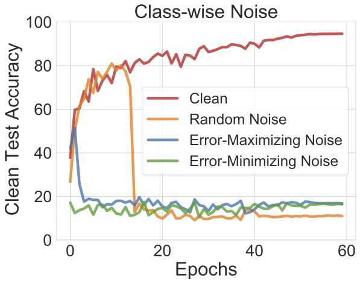
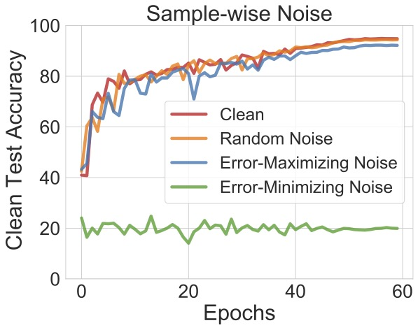
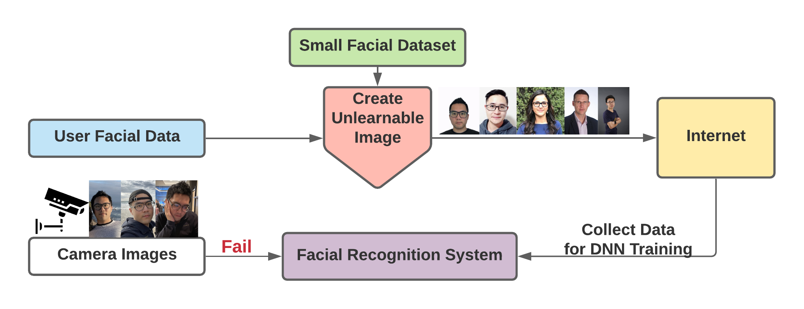
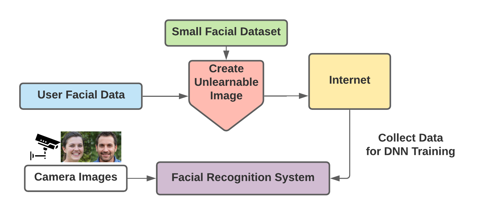
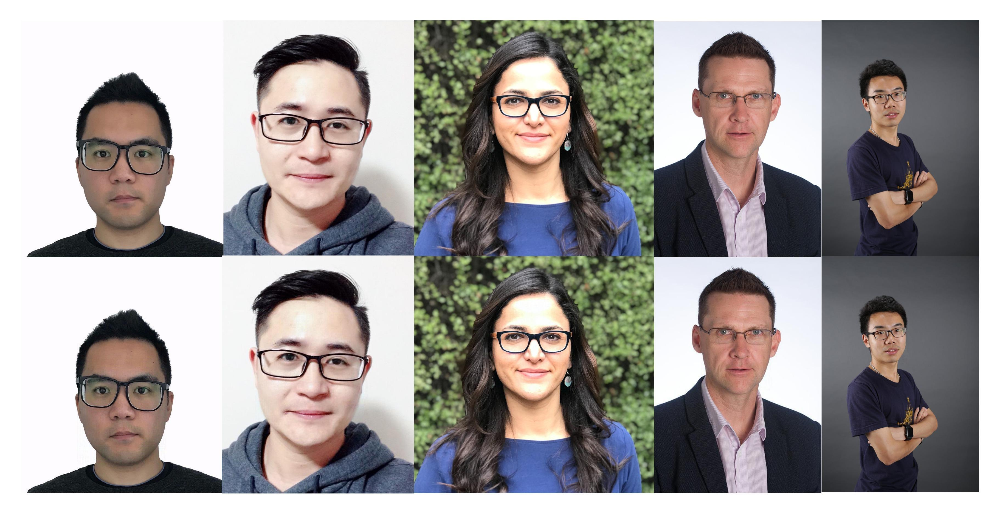

+++
title = "Unlearnable Examples: Making Personal Data Unexploitable"
+++

## We need more control of how our data is used.

The volume of "free" data on the internet has been critical to the current success of deep learning. However, it also raises privacy concerns about the unauthorized exploitation of personal data for training commercial models. We believe it's crucial to develop methods to allow individuals to take active actions and prevent their data from any unauthorized exploitations.

In this research, we present a type of *error-minimizing (unlearnable) noise* that can make training examples unlearnable to deep learning. *The unlearnable noise can be used by an individual to tag their data, so that it can’t easily be used by others for training their machine learning systems. This gives the owner more control about how their data is used.*


---
#### What are Unlearnable Examples?
*AI is supposed to learn from its own mistakes (errors).  But what happens if there are no mistakes or it is too easy to learn, will learning stop?*

*Unlearnable examples* exploits the above aspect of AI and tricks the model to believe *there is nothing to learn*. Deep Neural Networks (DNNs) trained on *unlearnable examples* will have a performance equivalent to random guessing on normal test examples.

<table><tr>
<td style="border:none"></td>
<td style="border:none"></td>
</tr></table>


The unlearnable effectiveness of different types of noise: random, adversarial (error-maximizing) and our proposed error-minimizing noise on CIFAR-10 dataset. The lower the clean test accuracy the more effective of the noise.


#### Difference to adversarial examples?
Adversarial examples can protect you from being recognized by a well-trained model (the model learns the version A of your data, while adversarial examples are version B), while unlearnable examples protect your data from contributing to any model training.

#### How to use unlearnable noise to protect your data?
Before you release your data to the wild, add an imperceptible noise to the data to create unlearnable data. We need to pre-generate the noise based on a public dataset, based on image categories (classes). Then you can choose the category-specific noise to add to your image according to its category. The noise can also be generated for each image individually (sample-wise noise).

We plan to develop an app for you to use in the future.


<!--  -->

---
## Examples on CIFAR-10
In our code repository, we have a [QuickStart notebook](https://github.com/HanxunH/Unlearnable-Examples/blob/main/QuickStart.ipynb) that contains minimal implementations for sample-wise error-minimizing noise.


This is an example of Unlearnable Examples on CIFAR-10.
From left to right: Original Images, Visualization of the Error-Minimizing Noise and Unlearnable Images.


---
## ICLR-2021 Poster


---
## Researchers
* [Hanxun Huang](https://hanxunh.github.io/) , PhD student, The University of Melbourne
* [Xingjun Ma](http://xingjunma.com/) , Associate Professor, Fudan University
* [Sarah Erfani](https://people.eng.unimelb.edu.au/smonazam/) , Senior Lecturer, The University of Melbourne
* [James Bailey](https://people.eng.unimelb.edu.au/baileyj/) , Professor, The University of Melbourne
* [Yisen Wang](https://yisenwang.github.io/) , Assistant Professor, Peking University



- Top row: original photos;
- Bottom row: unlearnable photos generated using our technology.


## Media Coverage
* Pursuit: [Blocking AI to keep your personal data your own](https://pursuit.unimelb.edu.au/articles/blocking-ai-to-keep-your-personal-data-your-own)
* Gadgets 360: [Worried About Privacy for Your Selfies? These Tools Can Help Spoof Facial Recognition AI](https://gadgets.ndtv.com/science/news/facial-recognition-ai-spoofing-for-selfies-fawkes-lowkey-image-cloaking-adversarial-attacks-2439007)
* MIT Technology Review: [How to stop AI from recognizing your face in selfies](https://www.technologyreview.com/2021/05/05/1024613/stop-ai-recognizing-your-face-selfies-machine-learning-facial-recognition-clearview/)

---
## Cite Our Work
```
@inproceedings{huang2021unlearnable,
    title={Unlearnable Examples: Making Personal Data Unexploitable},
    author={Hanxun Huang
      and Xingjun Ma
      and Sarah Monazam Erfani
      and James Bailey
      and Yisen Wang},
    booktitle={ICLR},
    year={2021}
}
```
